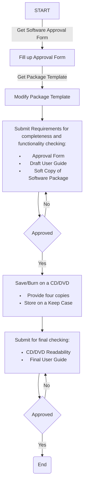

# Thesis Software Package Guide
WVSU College of Information and Communications Technology guidelines for thesis software packaging.

***

Your thesis software development files are combined into a single source tree. It should contain all the components and documentation needed to build and run the software on its target platform (Linux/Windows/OS X/Andriod/iOS/others). This document provides the specifications of what your package should contain.

### Package directories overview
A common naming scheme should also be observed. Directory names are **lowercased** and words are separated by an underscore.

```python
# Thesis package source tree
[app_name]/
    src/
    lib/
    config/
    dist/
    doc/
    README.md
    DISCLAIMER.md
```
#### Package Source Tree Description

| Node | Description |
| ---- | :---- |
| [app_name] | This is the root folder. Its name quickly identifies your thesis software. Very long directory names are not recommended. |
| src | Contains code to build your thesis software. Includes the frontend and backend(if exists) components. |
| lib | Contains the third-party libraries used by your thesis software. |
| config | This is not required but it can contain custom configuration files needed by your software to work (```*.cfg```, ```*.sql```, etc). |
| dist |Packaged release build of your thesis software ready for deployment (installers/deployment files). **Take note that the thesis software installer/package should work**. |
| doc | **Include a DOC/PUB and PDF copy of your thesis software documentation** (ready to publish copy) and thesis software manual. |
| README.md | Contains information about the other files in your source code directory. It can also contain essential instructions on how to use or deploy your software. Please see this [example template](https://gist.github.com/jxson/1784669) as your guide|
| DISCLAIMER.md | Includes the disclaimer documentation of your thesis software. |

#### Mobile Apps
> Check the list below for the required additional contents for your mobile app to be approved.

* Only APK release builds will be accepted. Google is not accepting debug builds. Save it in your package ```dist``` folder.
* App’s short description — maximum of 80 characters saved in a text file inside the ```doc``` folder.
* App’s full description — maximum of 4000 characters saved in a text file inside the ```doc``` folder. Your app full description should not violate Google’s [metadata policies](https://play.google.com/about/storelisting-promotional/metadata/).
* Screenshots: JPEG or 24-bit PNG (no alpha). Min length for any side: 320px. Max length for any side: 3840px. At least 2 screenshots are required overall. Max 8 screenshots per type. For your app to be showcased in the ‘Designed for tablets’ list in the Play Store, you need to upload at least one 7-inch and one 10-inch screenshot. If you previously uploaded screenshots, make sure to move them into the right area below. — Google Play.
* Hi-res icon: 512 x 512, 32-bit PNG (with alpha).
* Feature Graphic: 1024 w x 500 h, JPG or 24-bit PNG (no alpha) — A showcase graphics for your app. You can check this [link](https://dribbble.com/shots/1711557-Google-Play-Screenshots-Feature-Graphic-and-More) for more samples.

#### Submission
* Your thesis source code root folder **should be compressed** (zip, rar, tar.gz, etc).
* It should be saved on a CD or DVD disc which is enclosed in a **keep case** for submission.
* The keep case and disc cover design **should include the logo of the University and College** as well as the title of your study.


* For the complete submission flow, see the guide below or visit [this link](https://mermaidjs.github.io/mermaid-live-editor/#/view/Z3JhcGggVEQKQVtTVEFSVF0gLS0-fEdldCBTb2Z0d2FyZSBBcHByb3ZhbCBGb3JtfCBCW0ZpbGwgdXAgQXBwcm92YWwgRm9ybV0KQiAtLT58R2V0IFBhY2thZ2UgVGVtcGxhdGV8IENbTW9kaWZ5IFBhY2thZ2UgVGVtcGxhdGVdCkMgLS0-IERbU3VibWl0IFJlcXVpcmVtZW50cyBmb3IgY29tcGxldGVuZXNzIGFuZCBmdW5jdGlvbmFsaXR5IGNoZWNraW5nOjxiciAvPjx1bD48bGk-QXBwcm92YWwgRm9ybTwvbGk-PGxpPkRyYWZ0IFVzZXIgR3VpZGU8L2xpPjxsaT5Tb2Z0IENvcHkgb2YgU29mdHdhcmUgUGFja2FnZTwvbGk-PC91bD5dCkQgLS0-IEV7QXBwcm92ZWR9CkUgLS0-IHxZZXN8IEZbU2F2ZS9CdXJuIG9uIGEgQ0QvRFZEPHVsPjxsaT5Qcm92aWRlIGZvdXIgY29waWVzPC9saT48bGk-U3RvcmUgb24gYSBLZWVwIENhc2U8L2xpPjwvdWw-XQpFIC0tPiB8Tm98IEQKRiAtLT4gR1tTdWJtaXQgZm9yIGZpbmFsIGNoZWNraW5nOjx1bD48bGk-Q0QvRFZEIFJlYWRhYmlsaXR5PC9saT48bGk-RmluYWwgVXNlciBHdWlkZTwvbGk-PC91bD5dCkcgLS0-IEh7QXBwcm92ZWR9CkggLS0-fFllc3xJKEVuZCkKSCAtLT58Tm98Rw):


